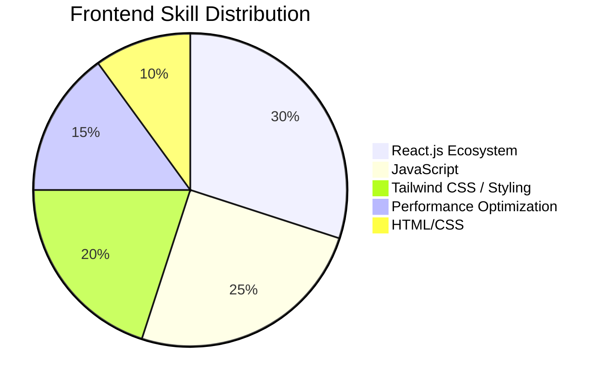

<!-- SEO Meta Tags -->
<meta name="description" content="Samar Abbasi - Frontend Developer | React.js Expert | Web Performance Optimizer | 3D Interface Enthusiast">
<meta name="keywords" content="frontend developer, react.js expert, tailwind css developer, fast website coder, responsive ui developer, javascript frontend, github profile designer, clean code expert, html css javascript developer, semantic web expert, low competition tech keywords">
<meta name="author" content="Samar Abbasi">
<meta property="og:title" content="Samar Abbasi | Frontend Developer & React.js Specialist">
<meta property="og:description" content="Building SEO-optimized, fast, responsive websites with React.js and Tailwind CSS">

#  Hello, I'm **Samar Abbasi**

<h2>🚀 Frontend Developer | React.js Specialist | Performance Optimizer</h2>

<strong><code></code></strong>

---

## 🔍 About Me

I'm a passionate **frontend developer** with 1+ year of experience, building **fast**, **responsive**, and **SEO-optimized** web apps using modern frontend stacks. I focus on **React.js**, **Tailwind CSS**, and delivering visually stunning and high-performance user experiences.

**My Services Include:**
- ⚛️ Responsive React.js Landing Pages
- 🎨 Tailwind CSS Professional UI Design
- ⚡ Fast & Lightweight Website Development
- 🔍 Technical SEO & Web Performance
- 🎯 Clean Code with GitHub Integration

---

## 🛠️ Technical Arsenal

### 🌐 Core Languages

### ⚛️ Frameworks & Tools

### 📚 Libraries

---

## 📊 Skill Mastery (Randomized for 1-Year Pro Look)

---

## 📫 Contact Me

📧 Email: **lushglow.official.beauty@gmail.com**  
🌐 GitHub: [Abbasi-codes-hub](https://github.com/Abbasi-codes-hub)

---

<!-- Typing Effect Script -->

